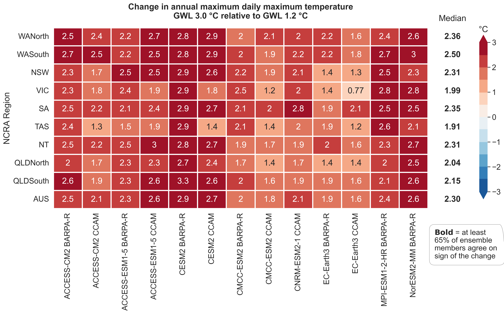

# ACS Hazard Team on Heatwaves and Extreme Heat

## Description
GitHub repository for the ACS Heat Team - heatwaves and extreme heat. 

## What are the extreme temperature indices?

There are a number of indices for monitoring changes in extreme temperatures, including:
 
> **TXx** – the hottest day of the year
> 
> **TXm** - annual mean daily maximum temperature
>
> **TXge35** – the number of days each year with maximum daily temperature ≥ 35 °C.
>
> **TXge40** – the number of days each year with maximum daily temperature ≥ 40 °C.
>
> **TXge45** – the number of days each year with maximum daily temperature ≥ 45 °C.
>
> **TNlt2** – the number of days each year with minimum daily temperature < 2 °C (a measure of potential frost days).

Here, maps for each of these indices are presented for Global Warming Levels 1.2, 1.5, 2.0 and 3.0 °C (with respect to the pre-industrial 1850-1900 mean value). These maps are created using data from climate model simulations.

Extreme temperatures may persist for one or two days, or longer. Extreme heat extending over three or more consecutive days is termed a heatwave. In Australia, heatwaves are classified using the Excess Heat Factor (EHF). A separate set of maps is provided for the EHF, including related measures of heatwave number, amplitude and duration.

## How are heatwaves measured?

Heatwaves are measured using the Excess Heat Factor (EHF), which was designed to identify heatwaves based on the potential impact on human health. It is calculated from the mean daily temperature, calculated as the average of the daily minimum and maximum temperature. This incorporates both how high temperatures reach during the day, as well as how low night-time temperatures drop, allowing the body to cool off overnight. A three-day average temperature is used to calculate the EHF, as prolonged exposure to heat exacerbates the impact on human health.

The EHF is calculated based on the difference between the three-day average temperature and the 95th percentile of daily mean temperature calculated over the period 1985-2014. This is an indicator of how unusual temperatures are relative to the long-term average. The EHF is then multiplied by a factor related to the difference between the three-day mean temperature and the previous thirty days. This enhances the EHF in cases where the preceding period has been relatively cool, as an abrupt increase in temperature can have a larger impact on health than where bodies are more acclimatised to high temperatures.

Periods of consecutive days with EHF>0 are combined into heatwave events. The maps show:

> Heatwave Frequency (**HWF**), the total number of days in a given year experiencing heatwave conditions.
>
> Heatwave Number (**HWN**), the total number of seperate heatwave events in a given year.
>
> Heatwave Amplitude (**HWA**), the hottest day of the hottest heatwave in a given year.
>
> Heatwave Duration (**HWD**), the length of the longest heatwave, in days.

Maps are presented for Global Warming Levels 1.2, 1.5, 2.0 and 3.0 °C (with respect to the pre-industrial 1850-1900 mean value), using data from climate model simulations. These maps are based on temperature only, and do not account for the additional health impact when heatwaves coincide with high humidity, which decreases the ability of humans to lose heat by sweating and increases overall health impacts. They also assume a static temperature threshold for identifying heatwaves based on the distribution of temperature in the current climate. This may not be appropriate in a significantly warmer climate as it does not account for the potential acclimatisation to heat.

## Products:
Status of the NCRA deliverables. 

The two dots (in order from first/top/left to last/bottom/right) represent the datasets used to compute indices:
- Dot 1: Pre-processed BARPA/CCAM – downscaled but NOT bias-corrected, 5 km (deliverable for 30 June)
- Dot 2: Bias-corrected BARPA/CCAM – downscaled AND bias-corrected, 5 km (deliverable for 31 July)
Where only one dot is in the cell the format type does not apply to the metric.
 
In terms of the colors:
- :green_circle: The data is available in its final official form
- :yellow_circle: The data creation is currently in progress and available soon
- :red_circle: The data processing has not yet started
- :white_circle: Not intended for delivery/not applicable

| Index/metric | variable_id | temporal resolution | reference | time series (ts) | GWLs ts | GWLs 2D | MME 2D | MME 2D change | Data location | Last update
| -----        | -----       | -----               | -----     | :-:              |:-:      |:-:      |:-:     |:-:            |-----             |-----
|Heatwave frequency|HWF|annual|[Nairn and Fawcett 2015](https://www.mdpi.com/1660-4601/12/1/227)|:green_circle: :green_circle:|:green_circle: :green_circle:|:green_circle: :green_circle:|:green_circle: :green_circle:|:green_circle: :green_circle:|`/g/data/ia39/ncra/heat/<variable_id>`|30/06/2024
|Heatwave duration|HWD|annual|[Nairn and Fawcett 2015](https://www.mdpi.com/1660-4601/12/1/227)|:green_circle: :green_circle:|:green_circle: :green_circle:|:green_circle: :green_circle:|:green_circle: :green_circle:|:green_circle: :green_circle:|`/g/data/ia39/ncra/heat/<variable_id>`|30/06/2024
|Heatwave number|HWN|annual|[Nairn and Fawcett 2015](https://www.mdpi.com/1660-4601/12/1/227)|:green_circle: :green_circle:|:green_circle: :green_circle:|:green_circle: :green_circle:|:green_circle: :green_circle:|:green_circle: :green_circle:|`/g/data/ia39/ncra/heat/<variable_id>`|30/06/2024
|Heatwave peak temperature|HWAtx|annual|[Nairn and Fawcett 2015](https://www.mdpi.com/1660-4601/12/1/227)|:green_circle: :green_circle:|:green_circle: :green_circle:|:green_circle: :green_circle:|:green_circle: :green_circle:|:green_circle: :green_circle:|`/g/data/ia39/ncra/heat/<variable_id>`|30/06/2024
|Annual mean daily maximum temperature|TXm|annual|[ETCCDI Climate Change Indices](http://etccdi.pacificclimate.org/list_27_indices.shtml)|:green_circle: :green_circle:|:green_circle: :green_circle:|:green_circle: :green_circle:|:green_circle: :green_circle:|:green_circle: :green_circle:|`/g/data/ia39/ncra/heat/<variable_id>`|28/06/2024
|Annual maximum daily maximum temperature|TXx|annual|[ETCCDI Climate Change Indices](http://etccdi.pacificclimate.org/list_27_indices.shtml)|:green_circle: :green_circle:|:green_circle: :green_circle:|:green_circle: :green_circle:|:green_circle: :green_circle:|:green_circle: :green_circle:|`/g/data/ia39/ncra/heat/<variable_id>`|28/06/2024|
|Days above 35C|TXge35|annual|[ETCCDI Climate Change Indices](http://etccdi.pacificclimate.org/list_27_indices.shtml)|:green_circle: :green_circle:|:green_circle: :green_circle:|:green_circle: :green_circle:|:green_circle: :green_circle:|:green_circle: :green_circle:|`/g/data/ia39/ncra/heat/<variable_id>`|28/06/2024
|Days above 40C|TXge40|annual|[ETCCDI Climate Change Indices](http://etccdi.pacificclimate.org/list_27_indices.shtml)|:green_circle: :green_circle:|:green_circle: :green_circle:|:green_circle: :green_circle:|:green_circle: :green_circle:|:green_circle: :green_circle:|`/g/data/ia39/ncra/heat/<variable_id>`|28/06/2024
|Days above 45C|TXge45|annual|[ETCCDI Climate Change Indices](http://etccdi.pacificclimate.org/list_27_indices.shtml)|:green_circle: :green_circle:|:green_circle: :green_circle:|:green_circle: :green_circle:|:green_circle: :green_circle:|:green_circle: :green_circle:|`/g/data/ia39/ncra/heat/<variable_id>`|28/06/2024
|Days below 2C|TNle02|annual|[ETCCDI Climate Change Indices](http://etccdi.pacificclimate.org/list_27_indices.shtml)|:green_circle: :green_circle:|:green_circle: :green_circle:|:green_circle: :green_circle:|:green_circle: :green_circle:|:green_circle: :green_circle:|`/g/data/ia39/ncra/heat/<variable_id>`|28/06/2024

## Sample Results

:exclamation: Hazard metrics have been computed and results are available on NCI (see directory paths in above table).

In addition to the data files (in netcdf format), results have also been presented in the form of maps (also available on NCI) and, for some hazard metrics, tables summarising regional changes in the aggregated hazard indice(s).

*Figure 1. Sample map showing the change in **TXx** (hottest day of the year) between GWL 3.0 and GWL 1.2. Here, results are presented as the ensemble median (i.e., the ensemble central estimate) for the 13 ACS regional climate model simulations used in the analysis.*

*Figure 2. Sample heatmap showing the change in **TXx** (hottest day of the year) between GWL 3.0 and GWL 1.2, averaged accross the different NCRA study regions. Here, results are presented for each of the 13 ACS regional climate model simulations, as well as the ensemble median.*

*Figure 3. Sample map showing the change in **HWF** (days per year experiencing heatwave conditions) between GWL 3.0 and GWL 1.2. Here, results are presented as the ensemble median (i.e., the ensemble central estimate) for the 13 ACS regional climate model simulations used in the analysis.*

*Figure 4. Sample heatmap showing the change in **HWF** (days per year experiencing heatwave conditions) between GWL 3.0 and GWL 1.2, averaged accross the different NCRA study regions. Here, results are presented for each of the 13 ACS regional climate model simulations, as well as the ensemble median.*

## How were the ensemble statistics (e.g., maps, regional summaries) created?

The following workflow was used to produce the ensemble maps and regional aggregate heatmaps.

For absolute values:

For changes between GWLs:

## Further reading:
> Nairn, J. R., and R. J. Fawcett, 2015: The excess heat factor: A metric for heatwave intensity and its use in classifying heatwave severity, Int. J. Environ. Res. Public Health, 12(1), 227–253, https://doi.org/10.3390/ijerph120100227
>
> Perkins, S. E., and L. V. Alexander, 2013: On the Measurement of Heat Waves. J. Climate, 26, 4500–4517, https://doi.org/10.1175/JCLI-D-12-00383.1.
>
> Zhang, X., L. Alexander, G. C. Hegerl, P. Jones, A. K. Tank, T. C. Peterson, B. Trewin, and F. W. Zwiers, 2011: Indices for monitoring changes in extremes based on daily temperature and precipitation data. Wiley Interdiscip. Rev.: Climate Change, 2, 851–870, https://doi.org/10.1002/wcc.147 

## Authors and acknowledgment
Hazard team:
- [ ] Mitchell Black (BOM, lead)
- [ ] Matt Beaty (ABS, alternate lead)
- [ ] Cass Rogers (BOM, contributor)
- [ ] David Hoffmann (BOM, contributor)
- [ ] Jessica Bhardwaj (BOM, contributor)
- [ ] Steph Jacobs (BOM, contributor)
- [ ] Aurel Griesser (BOM, contributor)
- [ ] Naomi Benger (BOM, contributor)

